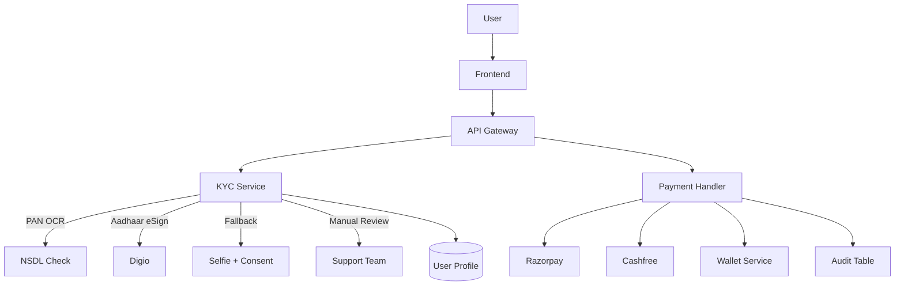
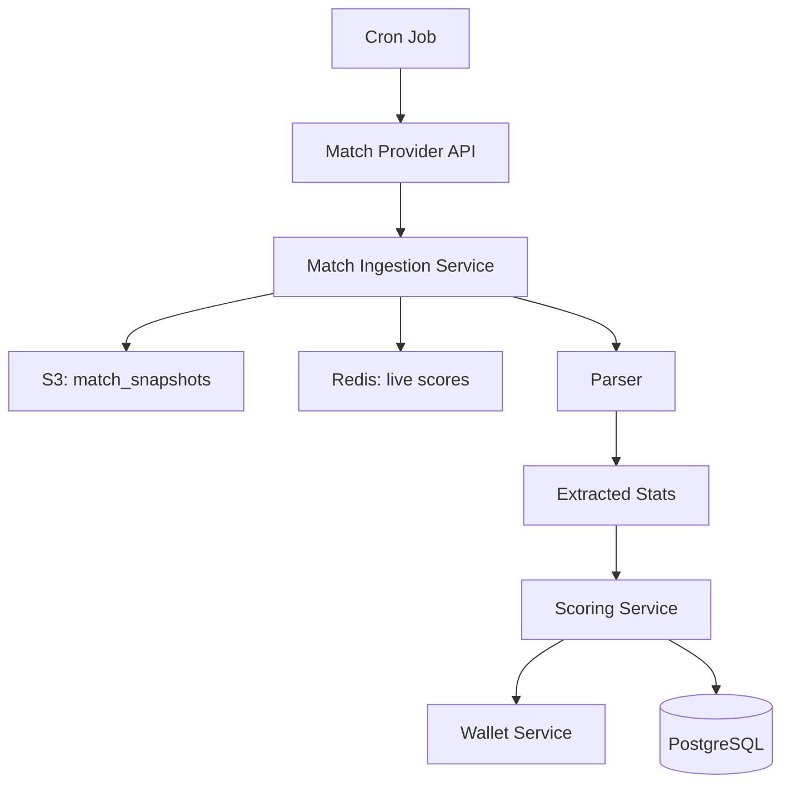
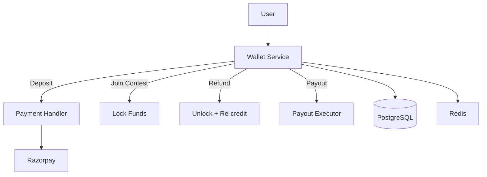

# System Architecture (messy dump)

ok so this is the backend infra i hacked together for a real-money fantasy app. not prod code, just the bones. if you're reading this, sorry for the chaos. infra was ECS + FastAPI + Postgres + a bunch of glue. see below for how the pieces kinda fit.

## infra sketch (mermaid because why not)

```mermaid
graph TD
  subgraph User
    A[User] --> B[Frontend App]
  end

  B --> C[API Gateway]
  C --> D[Auth Service]
  C --> E[KYC & Onboarding]
  C --> F[Wallet Service]
  C --> G[Match Ingestion]
  C --> H[Scoring Service]
  C --> I[Payment Handler]

  F --> J[(PostgreSQL)]
  G --> K[(S3)]
  H --> J
  I --> L[(Cashfree, Razorpay)]
  F --> M[(Redis)]
  G --> M
  H --> M

  C --> N[Task Queue (Celery/Async)]
  N --> H
  N --> I
```

- everything in ECS fargate, because k8s was overkill for v0
- postgres for wallet/users/contests, s3 for match dumps
- redis for pubsub + cache + whatever else i needed
- celery for async stuff (scoring, payouts)
- api gateway in front, because that's what you do

---

## KYC + payments (pain)



- PAN OCR → NSDL check, or Aadhaar eSign (digio), fallback to selfie+consent
- 3 fails? manual review, dump status in user.profile.state.kyc
- payments: razorpay first, cashfree if stuff breaks
- webhook → verify sig → queue task → poll until it works (or doesn't)
- log everything, because audits
- TODO: /kyc/status endpoint for support, never built it lol

---

## match ingestion + scoring (cron hell)



- poll match api every 60s (espncricinfo, dream11, whatever worked)
- cache scores in redis (ttl 120s), retry with backoff if api dies
- dump raw json to s3, parse out runs/wickets/whatever
- scoring runs async, updates wallet, triggers payouts
- TODO: rate limit handling, fallback to scraping if quota hits

---

## wallet flow (edge case city)



- deposit via razorpay → wallet credited
- join contest = lock funds, refund = unlock + re-credit
- payout on contest end, all async
- edge cases: concurrent joins (locking is hard), payment races, refunds
- TODO: daily reconciliation cron, dispute window for failed txns

---

## notes (for future me or whoever)
- infra as code = terraform, but it's a mess, sorry
- everything is async or event-driven if possible
- real providers: razorpay, cashfree, digio, nsdl
- idempotency everywhere, or you get double payouts (ask me how i know)
- not prod, just vibes
